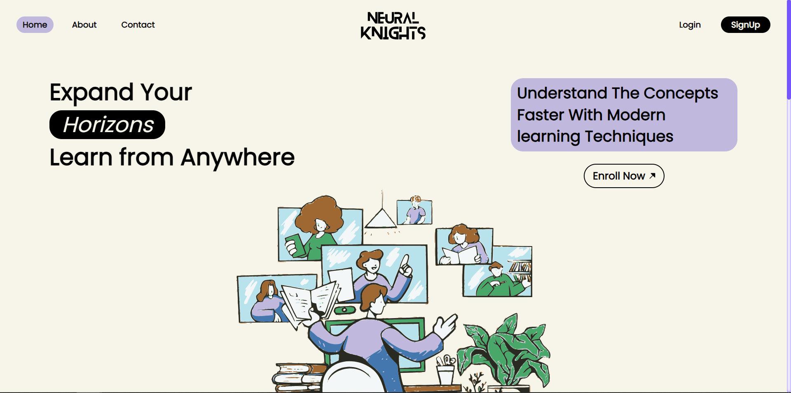

# intel-oneAPI

#### Team Name - Neural Knights

#### Problem Statement - Open Innovation in Education

## **A Brief of the Prototype:**

This Prototype is focuses on innovation in education and incorporates several key components to enhance learning experience of students and teachers. Currently, this prototype offers personalized recommendations, an interactive chatbot, quiz generation, and an intuitive user interface (UI).

- **Recommendation System:** Using Intel oneDAL library, Provides intelligent recommendations based on user preferences and learning history, ensuring a tailored learning experience.
- **Personalized Chatbot**: Using Intel oneDNN library, the chatbot offers interactive and personalized guidance, answering questions and assisting users with their educational inquiries.
- **Quiz Generation:** Utilizing the oneDNN library, the system generates quizzes based on summarized text, allowing users to assess their understanding and knowledge retention.
- **Interactive UI:** The user interface is designed to be intuitive and user-friendly, featuring seamless navigation, content browsing, and personalized recommendations to enhance the learning journey.
- **Authentication System:** A secure authentication system ensures safe access to user profiles and progress tracking, safeguarding sensitive information.
- **Conference Meeting Creation:** _Currently in process_, Users can easily schedule and host virtual meetings or webinars within the platform, promoting collaboration and fostering interactive learning experiences.

### Web App

Landing Page [Authentication]



Dashboard [Recommendation System ,ChatBot & Dynamic Schedule]


[Website_Link](
https://nknights.vercel.app)

## **Tech Stack:**

- Front-end: Next.js, React.js, Tailwind CSS
- Back-end: Node.js, Flask, Python
- Database: MongoDB
- Intel Libraries: Intel oneDAL, Intel oneDNN
- Deployment: Vercel, Render

## **Step-by-Step Code Execution Instructions:**

### Prerequisites

Before proceeding with the code execution, ensure that you have the following prerequisites installed and configured:

- Node.js
- Python 3.10 or higher
- Intel oneDAL and oneDNN libraries set up
- MongoDB database configured

### Installation

1. Clone the repository: `git clone https://github.com/your-username/project-repo.git`
2. Navigate to the project directory: `cd project-repo`

### .env file setup

- Create a .env file in the root directory of the Web_App project Folder.
- Add the following variables to the .env file:

```[.env]
NEXT_PUBLIC_GOOGLE_CLIENTID=<Your Google Client ID>
NEXT_PUBLIC_GOOGLE_SECRET= <Your Google Secret>
NEXT_PUBLIC_TWITTER_CLIENTID=<Twitter Client ID>
NEXT_PUBLIC_TWITTER_SECRET=<Twitter Secret>
NEXT_PUBLIC_MONGODB_URI=<MongoDB URL>
NEXT_PUBLIC_MONGODB_DB=<MongoDB URL 2>
NEXT_PUBLIC_SECRET=<Public Secret>
NEXTAUTH_URL=http://localhost:3000
NEXT_PUBLIC_UNSPLASH_URL=<Unsplash Access Token>
NEXT_PUBLIC_UNSPLASH_URLS=<Unsplash Access Token 2>
```

### Setup for Web_App

- Install dependencies: `npm install`
- Run the development server: `npm run dev`

### Setup for Backend

- Install dependencies: `pip install -r requirements.txt`

## **Optimization**
We run the text summarization amd recommendation code with and without the Intel optimizations and the results and difference in execution time is shown below

Recommendation system without intel optimizations


Recommendation system with Intel optimization


Difference 


Text summarization without intel optimizations


Text summarization with intel optimizations


Difference 


we can clearly notice the that the code with the intel optimizations executed faster than the code without optimizations
more optimisation are discussed in the seperate file `Intel optimizations benchmarking.pdf`
## **What I Learned:**

Throughout the development of this project, several valuable lessons which we learned and honed skills:

- Integration of advanced Intel libraries, including oneDAL and oneDNN, for building recommendation systems, Quiz Generation through text prompt and chatbots.
- Learn about intel APIs and how it works.
- Got hands-on Experience on intel liberaries like OneDNN & OneDAL and Optimise performance.
- Also Learn how to use dev-Cloud works with step by step code execution of ipnb file.
- Designing a modern and user-friendly UI using Next.js, React.js, and Tailwind CSS.
- Implementing secure user authentication and authorization mechanisms using Node
  .js and Flask.

- Leveraging MongoDB for efficient storage and retrieval of user data.
- Generating dynamic quizzes based on summarized text, enhancing user engagement and learning outcomes.
- Deploying the application on the Vercel and Render platform for seamless access and scalability.

## Medium Article :

[Medium Article Link](https://medium.com/@anujmalviya850/transforming-education-with-ai-ml-empowering-personalized-learning-experiences-fef68244b51b)
